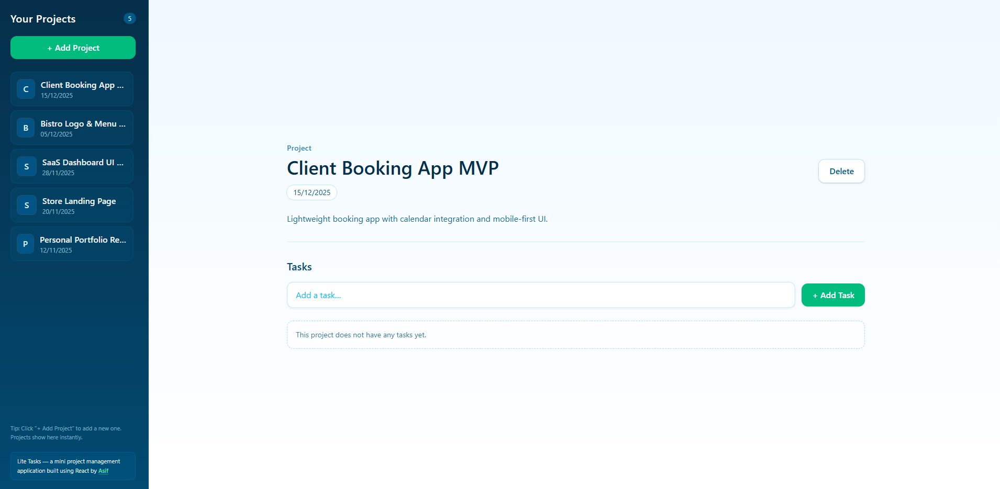
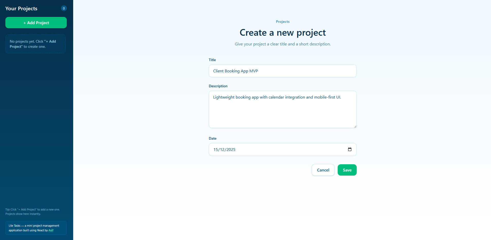
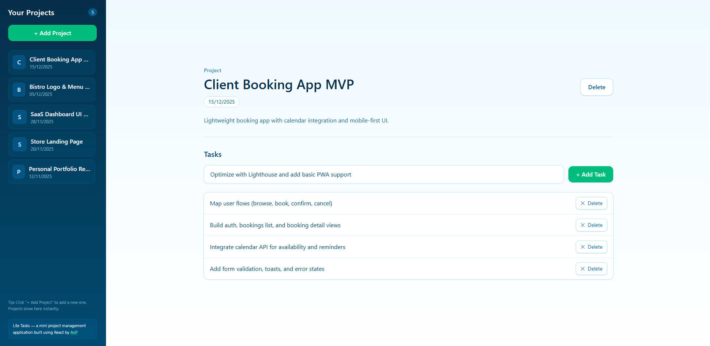

# liteTask v1.0 ✅📦

A lightweight, **mini project manager** built with **React** and **Tailwind CSS**. Add projects, jot down tasks, and keep track of what matters—fast.

**Live demo:** 👉 **[Add your Netlify URL here](https://your-netlify-site.netlify.app/)**

---

## ✨ Highlights

- 🧭 **Simple Project Flow** — Add projects with **title, description, and date**.
- 📌 **Sidebar Overview** — Dynamic sidebar shows **project count** and a **clickable list**.
- 🗒️ **Per‑Project Tasks** — View project details and add/delete tasks inline.
- 🧹 **Clean Deletes** — Remove individual tasks **or** the entire project.
- 📱 **Fully Responsive** — Optimized for phones, tablets, and desktops.
- ⚡ **Vite + React 19** — Modern tooling for instant feedback and fast builds.

---

## 💡 Why liteTask?

Sometimes you just want a **tiny workspace**: a place to capture a project and sprinkle in a few tasks—no logins, no dashboards, no setup. **liteTask** gives you that: a focused, delightful micro‑PM experience that lets you move on with your day. 🙌

---

## 🧩 Tech Stack

- **React 19** + **Vite 7**
- **Tailwind CSS 4**

> Package name: **`lite-tasks`**

---

## 🧱 App Structure (at a glance)

- **Home** — Intro / call‑to‑action to start a project
- **Add Project** — Form with _Title, Description, Date_ (validated in UI)
- **Sidebar** — Shows **total projects** and a **clickable list**
- **Project Details** — View project info and **add/delete tasks**

---

## 🚀 Getting Started

### ✅ Requirements

- **Node.js** 18+
- **npm**, **pnpm**, or **yarn**

### ⏳ Installation

```bash
# 1) Clone the repo
git clone https://github.com/Md-Asifullah/light-tasks.git
cd lite-tasks

# 2) Install dependencies
npm install

# 3) Start the dev server
npm run dev
# open the shown local URL (e.g., http://localhost:5173/)
```

### 🛠️ Useful Scripts

```bash
npm run dev       # Start Vite dev server
npm run build     # Production build
npm run preview   # Preview local production build
npm run lint      # Lint the codebase
```

---

## 🧭 How It Works (UI Flow)

1. **Add a Project** — Provide a **title**, **description**, and **date**.
2. **See it in the Sidebar** — The project appears with the total **count** updated.
3. **Open Project Details** — Click a project to view its **name, description, and date**.
4. **Add Tasks** — Quickly add tasks per project.
5. **Delete as Needed** — Remove **tasks** individually or **delete the project** entirely.

All state lives in memory (no server), so it’s **fast and ephemeral**—perfect for demos, quick planning, or prototyping.

---

## 📸 Screenshots

Home Page:



Add Project Page:



Project Details Page:



---

## 🌐 Deployment

Any static host will do (Netlify, Vercel, GitHub Pages, etc.).

Local production preview:

```bash
npm run build
npm run preview
```

### Netlify (example)

- Build command: `npm run build`
- Publish directory: `dist`

### Vercel (example)

- Framework preset: **Vite**
- Build command: `npm run build`
- Output directory: `dist`

---

## 🔍 Notes & Tips

- Use **stable IDs** for tasks/projects via `crypto.randomUUID()` (already in `App.jsx`) to keep UI updates predictable.
- Keep component state minimal—`App.jsx` holds the source of truth and passes props down to children for simple orchestration.

---

## 👤 About the Author

Made with ❤️ by **Md Asifullah** — Front-End Developer & Software Engineer.  
Portfolio: **https://www.artisanasif.com/**

---

## 🪪 License

This project is for **learning and portfolio purposes**.  
Feel free to fork, explore, and experiment.

> Heads-up: This is a **prototype** with **no backend persistence**—data lives only in memory during a session.
